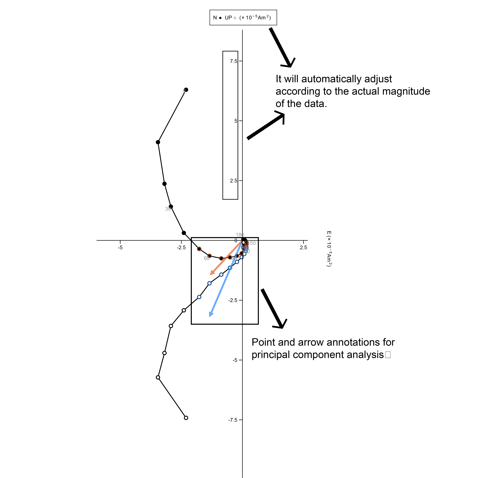

# Better-Zijderveld-plot

Creating High-Quality Zijderveld Diagrams for Paleomagnetic Data Analysis

Overview
Better Zijderveld Plot is a dedicated visualization tool for paleomagnetic research, offering advanced plotting capabilities for magnetic vector component diagrams. This library extends the traditional Zijderveld plot format with improved aesthetics, robust data handling, and integrated Principal Component Analysis (PCA) functionality.

While a basic Zijderveld plot—such as those in pmagpy—can be implemented without relying on matplotlib's axes object by manually drawing lines and points on a hidden axis, this approach limits flexibility, particularly in customizing coordinate axes. In contrast, Better Zijderveld Plot leverages the full functionality of the matplotlib axes object, allowing for dynamic scaling and axis range adjustments based on the plotted data. Some algorithms in this tool are adapted from pmagpy to ensure methodological consistency.

Key Features

Enhanced Zijderveld Plots: Produce high-quality North–East–Up (NEU) vector component diagrams suitable for publication, with fully customizable visual styles.

Smart Axis Management: Implements automatic tick spacing, adaptive scientific notation, and responsive scaling for optimal plot readability.

